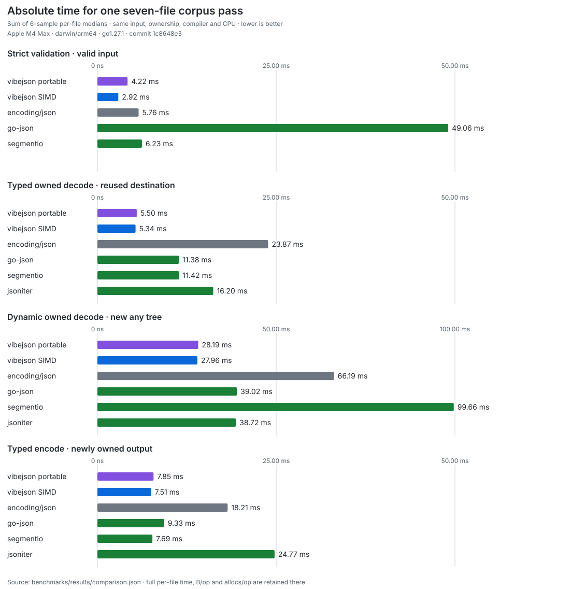
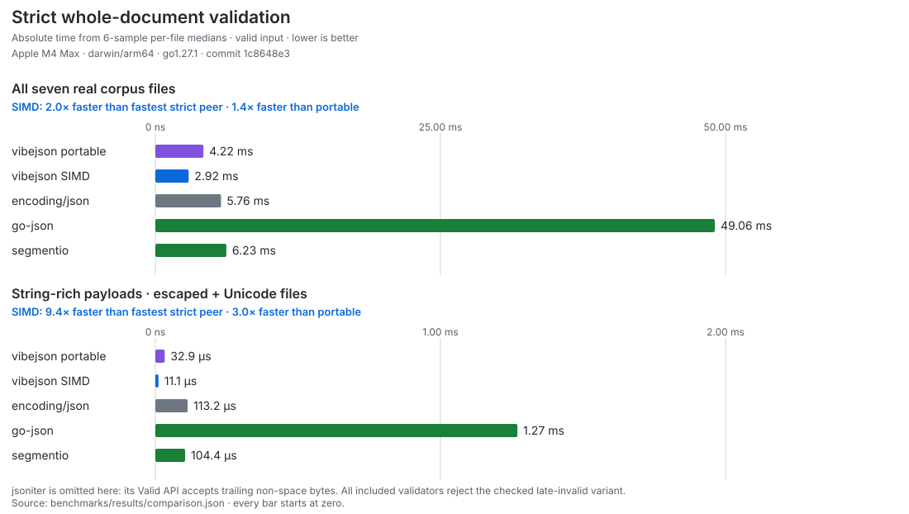

# vibejson

[](https://github.com/thesyncim/vibejson/actions/workflows/ci.yml)
[](https://pkg.go.dev/github.com/thesyncim/vibejson)

`vibejson` is a strict, allocation-conscious JSON library for Go applications
that need more control than a single `Marshal` or `Unmarshal` call provides. It
combines compiled typed codecs, streaming, JSON Pointer selection, caller-backed
structural indexes, and an owning ordered document model in one module.

The root module:

- has no dependencies outside the Go standard library;
- provides a portable implementation on supported Go releases;
- can enable an experimental Go-native SIMD backend with the repository's
  pinned development toolchain; and
- makes ownership and borrowing rules explicit on every zero-copy surface.

The project is pre-v1. Public APIs may change, and the low-level `x/` packages
carry no compatibility promise. The repository also does not yet have a
project-wide license; see [Project status](#project-status) before redistributing
the code.

## Requirements

Go 1.26 builds the supported portable implementation:

```sh
go get github.com/thesyncim/vibejson@latest
```

The optional SIMD source lane requires the exact compiler pinned by
[`scripts/bootstrap-gotip.sh`](scripts/bootstrap-gotip.sh). Normal users do not
need that toolchain or `GOEXPERIMENT=simd`.

If you used the former module name or the database packages that previously
lived in this repository, follow [MIGRATION.md](MIGRATION.md).

## Quick start

`Marshal` and `Unmarshal` compile and cache a plan for each Go type:

```go
package main

import (
	"fmt"

	"github.com/thesyncim/vibejson"
)

type Event struct {
	ID      int      `json:"id"`
	Name    string   `json:"name"`
	Labels  []string `json:"labels,omitempty"`
	Enabled bool     `json:"enabled"`
}

func main() {
	var event Event
	if err := vibejson.Unmarshal(
		[]byte(`{"id":7,"name":"launch","enabled":true}`),
		&event,
	); err != nil {
		panic(err)
	}

	data, err := vibejson.Marshal(&event)
	if err != nil {
		panic(err)
	}
	fmt.Println(string(data))
}
```

For a repeated hot path, compile once and reuse both the codec and caller-owned
storage:

```go
decoder, err := vibejson.CompileDecoder[Event](vibejson.DecoderOptions{
	Replace: true,
})
if err != nil {
	return err
}
encoder, err := vibejson.CompileEncoder[Event](vibejson.EncoderOptions{})
if err != nil {
	return err
}

if err := decoder.Decode(src, &event); err != nil {
	return err
}
buf, err = encoder.AppendJSON(buf[:0], &event)
```

Compiled encoders and decoders are immutable and safe for concurrent use. Each
decode still needs a separately synchronized destination, and each encode needs
its own writable output slice.

## Choose an API

| Task | API | Result lifetime |
| --- | --- | --- |
| Occasional typed encode/decode | `Marshal`, `Unmarshal` | Owned |
| Repeated typed encode/decode | `CompileEncoder`, `CompileDecoder` | Configurable |
| Validate one complete value | `Valid`, `Validate` | No retained result |
| Compact, indent, or canonicalize | `AppendCompact`, `AppendIndent`, `AppendCanonicalize` | Caller-owned output |
| Process NDJSON or concatenated values | `Reader`, `DecodeNext`, `Writer`, `EncodeTo` | Reader values are borrowed |
| Select one RFC 6901 path | `GetRaw`, `CompilePointer` | Borrowed `RawValue` |
| Navigate one document repeatedly | `BuildIndex`, `Index`, `Node` | Borrows source and index storage |
| Keep an ordered dynamic document | `Parse`, `Value` | Owned by default |
| Scan arrays or objects once | `EachArray`, `EachObject` | Callback values are borrowed |
| Evaluate JSON containment | `RawContains`, `Node.Contains` | No retained result |

### Typed codec options

Default typed decoding follows `encoding/json` merge behavior: existing maps,
pointers, and struct state may be reused, and fields absent from the document
remain unchanged. `DecoderOptions.Replace` instead makes a reused destination
behave like a fresh zero value while retaining unique reusable storage where it
is safe to do so.

Other decoder options control:

- maximum nesting depth;
- owned versus zero-copy strings;
- unknown-field rejection;
- case-sensitive field matching;
- `json.Number` for dynamically typed numbers; and
- the opt-in `json:",inline"` catch-all extension.

Encoder options control HTML escaping and the matching `json:",inline"`
extension. Custom `json.Marshaler`, `json.Unmarshaler`,
`encoding.TextMarshaler`, and `encoding.TextUnmarshaler` methods are honored.
The native `MarshalerSimd` and `UnmarshalerSimd` hooks are advanced, pre-v1
interfaces; ordinary applications should start with the standard interfaces.

## Streaming

`Reader` accepts whitespace-delimited, NDJSON, and directly concatenated
top-level JSON values. `DecodeNext` frames and decodes each value through a
compiled decoder:

```go
reader, err := vibejson.NewReaderWithOptions(input, vibejson.ReaderOptions{
	MaxValueBytes: 1 << 20,
})
if err != nil {
	return err
}

var event Event
for vibejson.DecodeNext(reader, decoder, &event) {
	handle(event)
}
if err := reader.Err(); err != nil {
	return err
}
```

A zero `MaxValueBytes` is unbounded. Set a positive limit for network or other
untrusted input. `Reader.Bytes`, `Reader.Cursor`, and zero-copy decoded values
may alias the rolling reader buffer and become invalid on the next advance.

`Writer` emits complete values from a compiled encoder through `EncodeTo`, or
builds values through state-checked token methods. Call `Writer.Newline`
between top-level values when producing NDJSON.

## Selection and document navigation

Use `GetRaw` for one RFC 6901 lookup:

```go
raw, ok, err := vibejson.GetRaw(src, "/profile/name")
if err != nil {
	return err
}
if !ok {
	return errors.New("profile name is missing")
}
name, ok, err := raw.Text()
if err != nil {
	return err
}
if !ok {
	return errors.New("profile name is not a JSON string")
}
use(name)
```

`RawValue` aliases `src`. Copy `raw.Bytes()` or call `raw.AppendJSON` when the
result must outlive the input.

For repeated or out-of-order navigation, validate once and build an index in
caller-provided storage:

```go
entries, err := vibejson.RequiredIndexEntries(src)
if err != nil {
	return err
}
storage := make([]vibejson.IndexEntry, 0, entries)
index, err := vibejson.BuildIndex(src, storage)
if err != nil {
	return err
}

profile, ok := index.Root().Get("profile")
```

`RequiredIndexEntries` performs its own complete validation pass. In a loop,
retaining storage and growing it only after `document.ErrIndexFull` avoids that
extra pass. The returned `Index` borrows both the JSON source and the index
entry slice.

Use `Parse` when the document and its ordered object members must own their
storage. `ParseOptions` with `Options.ZeroCopy` can opt back into borrowing the
source.

## Validation and transforms

`Valid` reports whether a byte slice contains exactly one strict JSON value.
`Validate` returns a `SyntaxError` with the failing byte offset.

The transform families validate while writing:

- `Compact` and `AppendCompact` remove insignificant whitespace;
- `Indent` and `AppendIndent` format with a caller-selected prefix and indent;
  and
- `Canonicalize` and `AppendCanonicalize` sort object members recursively by
  decoded UTF-8 key while preserving number spellings, array order, duplicate
  key order, and normalized string content.

The canonical form is deterministic but is not RFC 8785.

The `Append` forms reuse caller-owned capacity. On error, consult the function's
Go documentation for its output-prefix contract.

## Ownership and allocation

| Surface | Ownership rule |
| --- | --- |
| `Marshal`, `Compact`, `Indent`, `Canonicalize` | Return newly owned bytes |
| Default typed decoding | Returned strings and dynamic values do not alias input |
| `DecoderOptions.ZeroCopy` | Eligible strings and number spellings may borrow input |
| `RawValue`, `EachArray`, `EachObject` | Borrow the original JSON bytes |
| `BuildIndex` | Borrows both `src` and caller-provided entries |
| `Parse` | Owns source and index storage |
| `ParseOptions` with `ZeroCopy` | Borrows source; still owns its index |
| `Reader.Bytes`, `Reader.Cursor`, zero-copy `DecodeNext` | Borrow the rolling reader buffer |
| `Encoder.AppendJSON` and transform `Append` forms | Return caller-owned output, possibly reusing capacity |

Caller-buffered operations can avoid heap allocation after plans and buffers are
warm. Compilation, dynamic interface types, custom methods, buffer growth, and
new high-water marks have separate allocation behavior. Treat allocation as a
per-operation contract and verify the exact path you depend on.

## Packages

| Package | Purpose | Stability |
| --- | --- | --- |
| `github.com/thesyncim/vibejson` | High-level codecs, streams, selection, indexes, and values | Pre-v1 |
| `github.com/thesyncim/vibejson/document` | Shared document kinds, options, and errors | Pre-v1 |
| `github.com/thesyncim/vibejson/simd` | Numeric/time helpers and backend reporting | Pre-v1 |
| `github.com/thesyncim/vibejson/x/scanner` | Low-level JSON byte scanning | Unstable |
| `github.com/thesyncim/vibejson/x/kernels` | Structural and grammar kernels | Unstable |
| `github.com/thesyncim/vibejson/x/byteview` | Unsafe read-only byte/string views | Unstable |
| `github.com/thesyncim/vibejson/x/floatconv` | Decimal-to-binary conversion kernel | Unstable |
| `github.com/thesyncim/vibejson/x/jsonfields` | `encoding/json`-compatible field resolution | Unstable |

The `x/` packages are exported so sibling engines such as
[vibedb](https://github.com/thesyncim/vibedb) can share the same low-level
contracts. They are not a second recommended application API.

## Performance and SIMD

Portable Go is the behavioral reference. The optional SIMD lane replaces only
selected scanning and structural kernels; codec semantics, ownership, errors,
and output bytes must remain identical.

The current publication is an absolute, machine-specific snapshot over the
6.64 MB pinned Go standard-library corpus. It keeps owned decode and encode
contracts matched across libraries:



SIMD has its largest measured end-to-end effect on strict validation of
string-rich payloads—9.3× faster than the fastest compatible peer for the
escaped and Unicode corpus pair—while number-dense inputs correctly show much
smaller gains:



These are not context-free claims. The measured commit, full compiler version,
experiment flags, CPU, inputs, sample count, commands, allocation chart, and
per-file medians are retained in the
[benchmark snapshot](benchmarks/README.md). See
[Benchmarking](docs/benchmarking.md) for the complete suites and
regression-gate workflow.

## Documentation

- [Documentation map](docs/README.md)
- [Package documentation](https://pkg.go.dev/github.com/thesyncim/vibejson)
- [Architecture](docs/architecture.md)
- [Benchmarking](docs/benchmarking.md)
- [Contributing](CONTRIBUTING.md)
- [Migration guide](MIGRATION.md)
- [Security policy](SECURITY.md)
- [Source provenance](docs/provenance.md)
- [Generated unsafe-code inventory](UNSAFE.md)

## Project status

The exported Go documentation and tests define current behavior. The root and
`document`/`simd` APIs remain pre-v1; the `x/` packages are explicitly unstable.

There is no root project `LICENSE` yet. `LICENSE-GO` and `LICENSE-SIMDJSON`
apply only to the identified upstream-derived material recorded in
[docs/provenance.md](docs/provenance.md); they do not license the repository as
a whole. Security issues should be reported through the private process in
[SECURITY.md](SECURITY.md).
