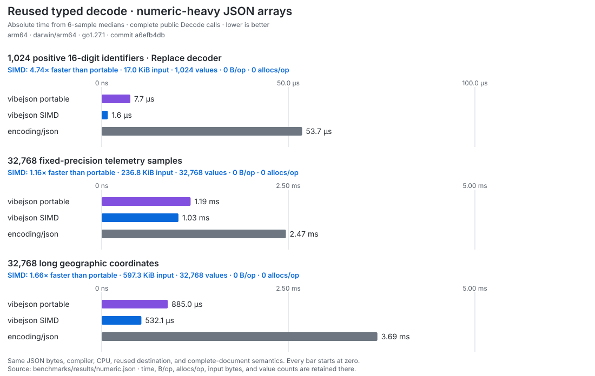
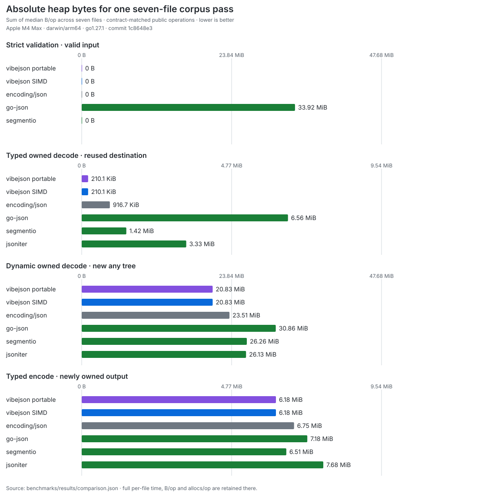

# Benchmark snapshot

This directory publishes a machine-specific, reproducible comparison of public
JSON operations. The charts show absolute measurements; they are not normalized
scores, kernel-only throughput, or a blend of unlike ownership contracts.

The current snapshot measures commit
`6f25fb7057cf36b2bc8e184a361a93015fa91c28` on an Apple M4 Max
(`darwin/arm64`) with the pinned
`go1.27-devel_03845e30f7` compiler, one CPU, six samples per row, and a 300 ms
target per sample. The seven pinned Go standard-library corpus files contain
6,638,273 input bytes in total.

## Absolute results


Each bar is the sum of the six-sample median for every corpus file: the absolute
time to apply that operation serially to all seven files once. Every panel starts
at zero and has its own scale.

The string-rich validation lane is the real workload where SIMD has its largest
end-to-end effect:


| Public workload | vibejson SIMD | Fastest compatible peer | Difference |
| --- | ---: | ---: | ---: |
| Strict validation, all seven files | 1.92 ms | 3.82 ms (`encoding/json`) | 2.0× faster |
| Strict validation, escaped + Unicode files | 7.35 µs | 68.05 µs (segmentio) | 9.3× faster |
| Typed owned decode, all seven files | 4.40 ms | 7.51 ms (go-json) | 1.7× faster |
| Dynamic owned decode, all seven files | 14.03 ms | 26.16 ms (go-json) | 1.9× faster |
| Typed owned encode, all seven files | 4.97 ms | 5.08 ms (segmentio) | effectively tied |

The focused validation result is intentionally described as string-rich, not
universal. Number-dense `canada_geometry` and `golang_source` inputs remain on
the recursive validator because forcing the SIMD positions pipeline was slower:
position extraction and stage 2 cost more than they save when punctuation and
scalar starts are dense.

## Numeric SIMD results

The focused numeric chart measures complete public `Decode` calls into reused
typed slices. It compares the same JSON bytes under vibejson portable,
vibejson SIMD, and `encoding/json`; input generation, decoder compilation, and
destination allocation stay outside the timer.



The three workloads are deliberately concrete rather than synthetic kernel
loops: 1,024 fixed-width identifiers, 32,768 fixed-precision telemetry values,
and 32,768 long geographic coordinates. The identifiers exercise batched digit
conversion; the float workloads exercise SIMD structural discovery while
retaining the shared exact scalar conversion path. Each row records its input
bytes and value count in [`results/numeric.json`](results/numeric.json).

Time is not the only cost:



For example, vibejson's typed owned decode is faster here but retains a private
source copy to make borrowed string spans owned; it consequently allocates
6.50 MiB per pass versus 916.7 KiB for `encoding/json`. The allocation chart is
published beside the time chart so that tradeoff is visible rather than hidden.

## Fairness contract

The comparison harness enforces these rules before starting any timer:

- all libraries receive the exact same decompressed source bytes;
- typed decoders use the same concrete Go model and reuse one destination;
- typed and dynamic owned decoders must equal the `encoding/json` result;
- encoders receive the same typed value, return newly owned output, and must
  round-trip to the same JSON value;
- validators must accept the corpus input and reject the same late-invalid
  variant;
- type caches, output-size hints, corpus loading, and correctness checks remain
  outside timed regions; and
- each timed row records `ns/op`, `B/op`, and `allocs/op`.

The numeric comparison additionally requires complete-document decoding into
the same concrete slice element type, one pre-sized reused destination, the
same input bytes and value count, and zero allocation for every published row.
`encoding/json.Unmarshal` is the compatible standard-library peer; the
vibejson SIMD row changes only `GOEXPERIMENT`.

The portable comparison includes `encoding/json`, go-json v0.10.6, segmentio
v0.5.4, and jsoniter v1.1.12. The vibejson SIMD rows use the same pinned compiler,
machine, corpus, API contract, and single-CPU setting with
`GOEXPERIMENT=simd`.

jsoniter participates in decode and encode panels, but not strict validation:
its public `Valid` API accepts trailing non-space bytes after one valid value.
Including it in that panel would compare different contracts.

The owned peer chart does not mix in vibejson's compiled zero-copy decode or
caller-buffer encode APIs. Those are useful application choices, but comparing
them against newly owned peer results would make the chart look better by
changing the work.

## Reproduce

From a clean repository root:

```sh
TIP_GO="$HOME/sdk/vibejson-gotip/bin/go" \
  ./benchmarks/publish-comparison.sh
```

`BENCHTIME`, `COUNT`, and `BENCH_MACHINE` may be set explicitly for another
controlled machine. The publisher refuses a dirty worktree, captures raw logs
in a temporary directory, and rewrites:

- [`results/comparison.json`](results/comparison.json), containing corpus
  metadata, commands, per-file medians, and aggregates;
- [`results/numeric.json`](results/numeric.json), containing numeric workload
  shape and medians;
- [`charts/go-times.svg`](charts/go-times.svg);
- [`charts/go-allocations.svg`](charts/go-allocations.svg);
- [`charts/simd-validation-times.svg`](charts/simd-validation-times.svg); and
- [`charts/simd-numeric-times.svg`](charts/simd-numeric-times.svg).

Transient raw logs are not committed. Use
[`docs/benchmarking.md`](../docs/benchmarking.md) for the complete benchmark
coverage matrix and the interleaved baseline-versus-candidate regression gate.
